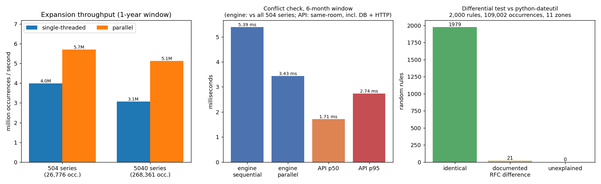

# Recurring Schedule Engine

A C#/.NET 8 engine and REST API that lets clinic and field-service schedulers expand RFC 5545 recurring bookings (RRULE) across time zones and find clashes between series before they confirm a booking. Over 2,000 random rules (109,002 occurrences) it agrees with python-dateutil with **0 unexplained mismatches**, and a conflict check against the seeded clinic schedule returns in **2.7 ms at p95** through the API.



| Measurement | Result | Source |
|---|---|---|
| Differential test vs python-dateutil | 2,000 rules, 109,002 occurrences, 11 IANA zones: 1,979 identical, 21 documented RFC differences, **0 unexplained** | `difftest/report.json` |
| Expansion, 504 series × 1 year (26,776 occurrences) | 6.7 ms single-threaded (4.0 M occ/s), 4.7 ms parallel (5.7 M occ/s) | `bench/results/ExpansionBenchmarks-report.md` |
| Expansion, 5,040 series × 1 year (268,361 occurrences) | 87 ms single-threaded (3.1 M occ/s), 52 ms parallel (5.1 M occ/s) | same |
| Conflict check, proposal vs all 504 series, 6 months (in-process) | 5.4 ms sequential, 3.4 ms parallel | `bench/results/ConflictBenchmarks-report.md` |
| `POST /api/conflicts/check`, 1,000 requests, same-room series, 6 months, incl. PostgreSQL + HTTP | p50 1.71 ms, **p95 2.74 ms**, p99 4.08 ms | `bench/results/latency.json` |

Benchmarks ran on a 4-core Linux VM (BenchmarkDotNet ShortRun job, .NET 8).

## Quickstart

```bash
docker compose up -d --build     # PostgreSQL + API on :25080, seeded with 504 clinic series
curl "localhost:25080/api/occurrences?from=2026-03-02T00:00:00Z&to=2026-03-09T00:00:00Z&resource=Toronto%20Room%20101"
curl -X POST localhost:25080/api/conflicts/check -H 'Content-Type: application/json' -d @examples/proposed_series.json
```

The second command lists one week of bookings in a room. The third proposes "Hand Therapy, Tue/Thu 10:00 for 90 minutes" in that room and returns every clash in Q1 2026, with the overlapping minutes. The overlaps move by an hour in UTC after the 8 March DST change.

Without Docker: `scripts/dev-db.sh start` (local PostgreSQL on :25432), then
`Seed__File=data/clinic_schedule.json dotnet run --project src/Rse.Api`.

### API

| Method | Path | Purpose |
|---|---|---|
| `POST` | `/api/series` | Create a series `{title, resource, rrule, dtStart (local), timeZone, durationMinutes, exDates[]}` |
| `GET` | `/api/series[?resource=]` · `/api/series/{id}` | List or fetch stored series |
| `DELETE` | `/api/series/{id}` | Remove a series |
| `GET` | `/api/occurrences?from=&to=[&resource=]` | Every occurrence in a window (max 366 days), sorted by UTC start |
| `POST` | `/api/conflicts/check` | `{series, from, to, maxPerSeries}` → clashes with stored series on the same resource |

## How it works

- **Parser** (`src/Rse.Engine/RRuleParser.cs`) handles FREQ (DAILY to YEARLY), INTERVAL, COUNT, UNTIL (UTC, local or date-only), BYDAY with ordinals, BYMONTHDAY (including negative values), BYMONTH, BYSETPOS and WKST. It rejects unsupported parts outright instead of ignoring them.
- **Expander** (`RuleExpander.cs`) walks periods (year, month, WKST-aligned week, day) in steps of INTERVAL. For each period it builds the candidate day set, applying RFC 5545's defaults from DTSTART: BYDAY ordinals count within the month, or within the year for YEARLY without BYMONTH. It then applies BYSETPOS and yields wall-clock times lazily. Invalid dates such as 30 February are skipped. Rules without COUNT can jump straight to the period that holds a window's start, so a 2030 query doesn't expand from 2020.
- **Time zones** (`TimeZoneResolver.cs`) convert each wall-clock occurrence to UTC using the IANA database, following RFC 5545 §3.3.5:
  - A time inside a DST gap uses the offset from before the gap, so 02:30 becomes 03:30 daylight time.
  - An ambiguous time in an overlap resolves to its first instance.
  - This also holds for half-hour shifts such as Australia/Lord_Howe.
- **Recurrence set** (`RecurrenceSet.cs`) combines DTSTART, RRULE and EXDATE. COUNT counts occurrences before EXDATE removes any, as the RFC requires. UNTIL is compared as a UTC instant when it is given in UTC.
- **Conflict detection** (`ConflictDetector.cs`) merges two lazy occurrence streams the way merge sort merges lists. At each step it advances whichever slot ends first, so a pair of series costs O(n + m) within the window and nothing outside it. Finished or not-yet-started series are filtered out by their bounds. The candidate series are compared in parallel with PLINQ.
- **API** (`src/Rse.Api`): ASP.NET Core minimal APIs and EF Core 8 with Npgsql. The migration (`Data/Migrations`) applies at startup, and an empty database is seeded from `Seed__File`.
- **Differential testing** (`difftest/`):
  - `rulegen.py` generates seeded random rules that favour hard cases: DST-switching zones, start times inside gaps and overlaps, start dates on transition days, BYSETPOS, negative month days, ordinal weekdays, WKST with INTERVAL > 1, COUNT/UNTIL boundaries and EXDATEs.
  - `run_difftest.py` expands each rule with the engine (through `src/Rse.Cli`) and with dateutil (`oracle.py`) and compares UTC instants. It classifies every mismatch (DST gap/overlap, COUNT/UNTIL boundary, BYSETPOS, ordinal BYDAY and so on) and writes `difftest/report.json`.

## Running the tests

```bash
dotnet test                                                        # 76 xUnit tests
python3 difftest/run_difftest.py --rules 2000 --fail-on-mismatch   # needs python-dateutil (difftest/requirements.txt)
```

The unit tests (`tests/Rse.Engine.Tests`) cover:
- the RFC 5545 §3.8.5.3 examples;
- DST gap, overlap and cross-zone cases;
- window queries checked against full enumeration;
- parser errors;
- the merge sweep checked against brute force;
- parallel results checked against sequential ones.

The integration tests (`tests/Rse.Api.Tests`) run the real API against PostgreSQL. They use `RSE_TEST_PG` if it is set, then the compose database on `localhost:25432` if it is running. Otherwise they create a throwaway cluster with the local `initdb`/`pg_ctl` on a free port and delete it afterwards.

To regenerate the results: `dotnet run -c Release --project bench/Rse.Bench` (BenchmarkDotNet), then `dotnet run -c Release --project bench/Rse.Bench -- latency http://localhost:25080 1000` against a running API, then `python3 scripts/plot_results.py`. The clinic data comes from `python3 tools/gen_clinic_schedule.py` (seeded).

## Design notes

- **Wall-clock first, UTC second.** Rules expand in local time and each occurrence then converts to UTC. A 09:00 clinic stays at 09:00 local all year, and clashes between a Toronto and a London series are found on true instants. The test `DstShiftCreatesTemporaryConflict` shows a collision that exists only during the three weeks when the two zones' DST dates differ.
- **Documented difference from dateutil (21 of 2,000 rules).** For `FREQ=WEEKLY` with `BYSETPOS`, dateutil starts the first week at DTSTART, so set positions count within a shortened week. The engine applies BYSETPOS to the whole WKST-aligned week, as the RFC defines it per week, and then drops occurrences before DTSTART. These mismatches are marked explained only when the engine's output exactly matches dateutil's own expansion with the first week evaluated in full. The harness never uses a catch-all.
- **DTSTART is not added automatically** when it doesn't match the rule. This follows dateutil and RFC 2445; RFC 5545 asks for DTSTART to be synchronised with the rule.
- **Parallelism.** Both the expansion and the conflict check are thread-safe and partitioned across cores. In the parallel expansion each partition expands and sorts its own series on a primitive `(ticks, rank)` key, and a k-way merge with a priority queue combines the sorted runs, so no single thread does a global sort. On the 4-core VM this gives a 1.4× speed-up at 504 series and 1.7× at 5,040. The remaining cost is allocating and copying the result lists, which is memory-bound.
- **UTC conversion fast path.** If the zone's offset is the same a day before and a day after a wall-clock time, there is no transition nearby and the conversion needs two offset lookups. The gap and overlap logic only runs near DST changes.

## Limitations

- No HOURLY/MINUTELY/SECONDLY and no BYHOUR/BYMINUTE/BYWEEKNO/BYYEARDAY: each series has one start time per day. There is no RDATE or full iCalendar import.
- The conflict sweep assumes a series' own occurrences don't overlap each other (duration shorter than the shortest gap between them).
- A date-only UNTIL counts the whole local day. dateutil treats it as midnight.
- No authentication, multi-tenancy or UI. Stored series are loaded from PostgreSQL on each request; there is no in-memory cache.
- The integration tests provision PostgreSQL directly instead of through containers, so the Docker image build is not part of `dotnet test`. The published API was started with the compose environment variables against an empty database (migration and 504-series seed applied), but the container image itself was not built in the benchmark environment.
